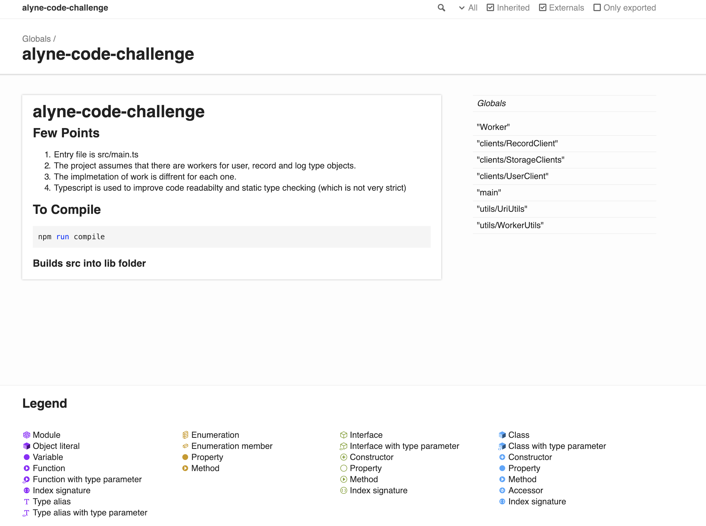

# alyne-code-challenge

## Few Points
1. Entry file is src/main.ts
2. The project assumes that there are workers for user, record and log type objects.
3. The implmetation of work is diffrent for each one.
4. Typescript is used to improve code readabilty and static type checking (which is not very strict)

## To Install dependencies
```
npm install
```

## To Compile 
```
npm run compile
```
### Builds src into lib folder


### See FE Documentation
```
Open file <root>/docs/index.html in Web  Browser
```